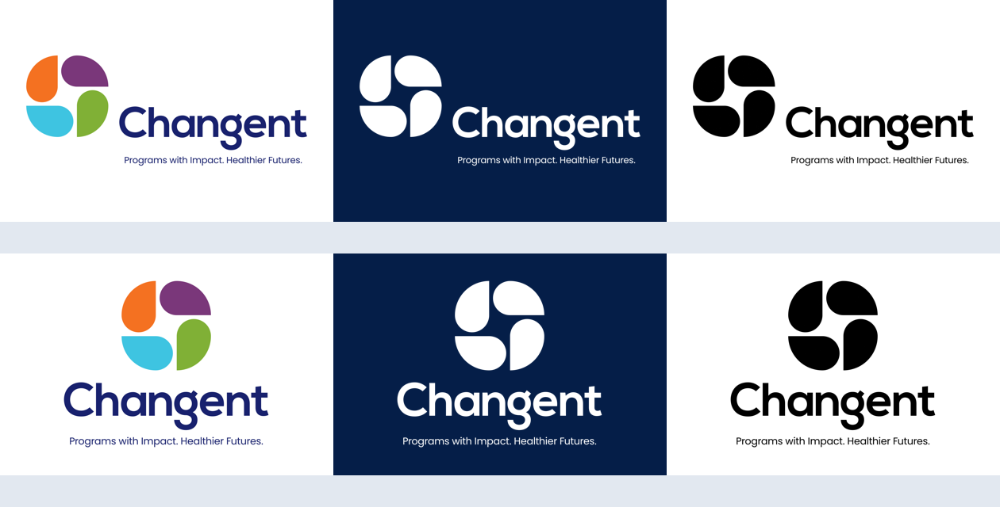

# Logos

Six lockups live in [`assets/logos/`](../assets/logos/). Pick by **orientation** (horizontal vs. vertical) and **background** (light vs. dark vs. mono).

| File | Orientation | Use on |
|------|-------------|--------|
| `changent-horizontal-primary.jpg` | Horizontal | **Light backgrounds** (white, `grey-150` canvas). Default for decks & UI headers. |
| `changent-horizontal-white.png` | Horizontal | **Dark backgrounds** (`#051E48` title/closing slides, navy header bar). Transparent PNG. |
| `changent-horizontal-black.jpg` | Horizontal | Mono / single-color print, faxes, low-ink contexts. |
| `changent-vertical-primary.jpg` | Vertical | Light backgrounds where width is constrained (left nav, square crops). |
| `changent-vertical-white.png` | Vertical | Dark backgrounds, constrained width. Transparent PNG. |
| `changent-vertical-black.jpg` | Vertical | Mono contexts, constrained width. |

## Which to reach for

- **Deck title & closing slides** (`#051E48` background) → `changent-horizontal-white.png`.
- **Deck content slides / report headers** (white card on light canvas) → `changent-horizontal-primary.jpg`.
- **Left navigation pane** (`#F3F2F0`, narrow) → `changent-vertical-primary.jpg`.
- **Anything on a dark surface** → always the `*-white.png` (transparent) version, never the JPG.

## Rules

- **Background match is mandatory.** Primary/black logos sit on light surfaces; the white PNG sits on dark surfaces. Never put the primary JPG (white-boxed) on a colored or dark background — the white rectangle will show.
- **Clear space:** keep padding around the logo of at least the height of the "C" in *Changent* on all sides.
- **Don't** recolor, stretch, rotate, add effects, or place the logo on a busy photo without sufficient contrast.
- **Minimum size:** keep the tagline legible — if it can't be read, use a version without the tagline (request one) or size up.
- The symbol's four petals use the brand hues (orange, purple, cyan, green) — consistent with the data-viz palette in [`color.md`](color.md). Don't substitute other colors.

## Formats

These are raster (JPG/PNG at 1300px wide). For large-format print, signage, or infinite scaling, **request vector (SVG/EPS/PDF)** masters and drop them alongside these — keep the same naming convention (`changent-{orientation}-{variant}.svg`).
